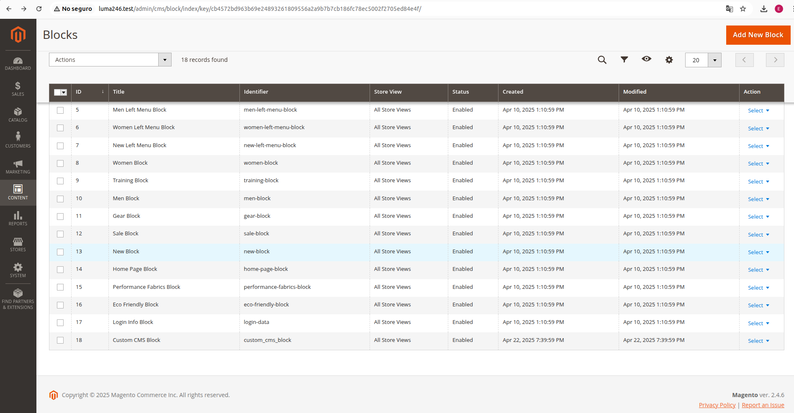

# Basic_CustomCMSBlock

## Overview



`Basic_CustomCMSBlock` is a Magento 2 module that automatically creates a custom CMS block during installation. The content of the block is dynamically loaded from an HTML file.

## Features

- Automatically creates a custom CMS block.
- Loads content from a specified HTML file.
- Supports multiple store views.

## Installation

1. Copy the module to `app/code/Basic/CustomCMSBlock`.
2. Run the following Magento commands:

    ```bash
    php bin/magento setup:upgrade
    php bin/magento setup:di:compile
    php bin/magento cache:flush
    ```

3. The CMS block will be created with the identifier `custom_cms_block`.


## Usage

To display the CMS block, use the following shortcode in a CMS page or static block:

```html
{{block class="Magento\Cms\Block\Block" block_id="custom_cms_block"}}
