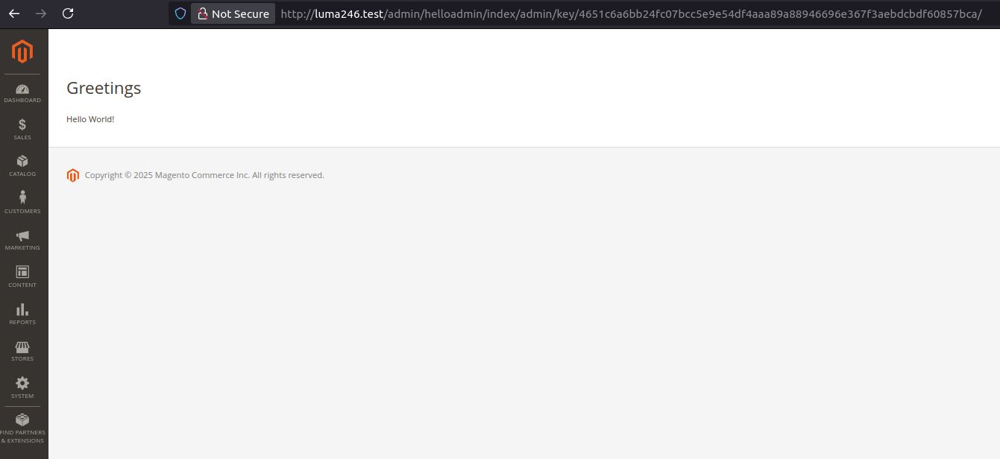
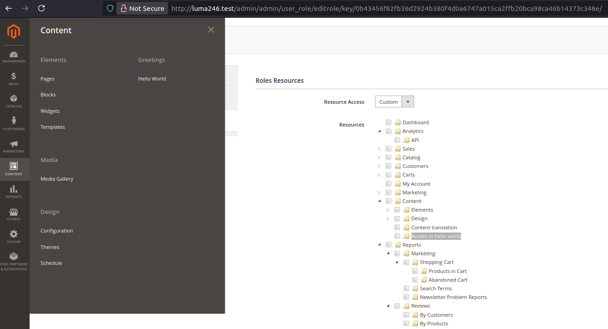

# Basic_HelloAdmin

This Magento 2 module displays a "Hello World!" message in the Magento admin panel. It's a simple example to learn how to create a basic module that interacts with the Magento backend.

# Preview






## Características

- Add an option to the Magento admin panel menu.
- Display a "Hello World!" message on a dedicated page within the admin panel.
- Use best practices such as controllers, access rights (ACLs), and backend layouts.

## Estructura del módulo

```plaintext
app/code/Basic/HelloAdmin/
├── Controller/
│   └── Adminhtml/
│       └── Index/
|          └── Admin.php
├── etc/
│   ├── acl.xml
│   ├── module.xml
│   └── adminhtml/
│       └── menu.xml
│       └── routes.xml
├── registration.php
└── view/
    └── adminhtml/
        └── layout/
            └── helloadmin_index_admin.xml
        └── templates/
            └── helloadmin.phtml
